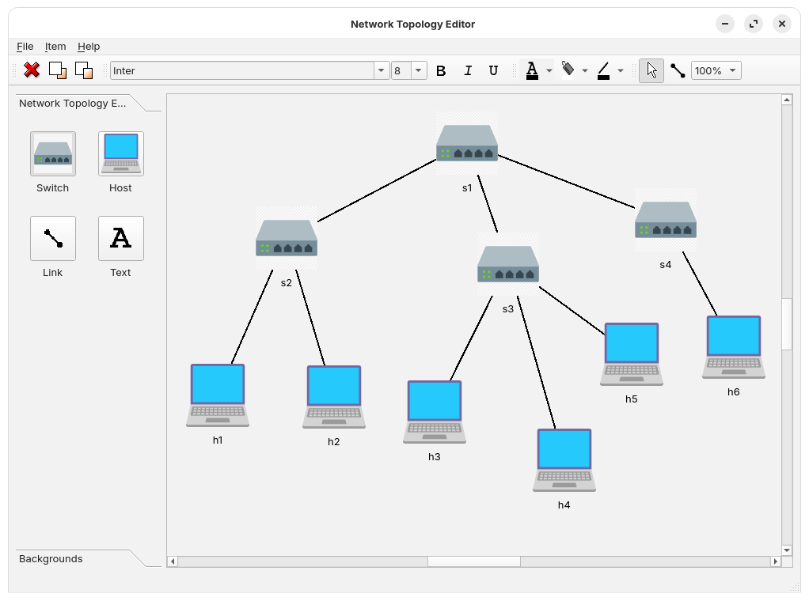

# Network Topology Editor

The Network Topology Editor is a Python/Qt-based GUI application for designing and simulating network topologies with Mininet.

Users can intuitively draw or generate custom network topologies via the graphical interface, export them as JSON files compatible with Mininet, and launch network simulations directly from the app.

The application also supports loading existing topologies from JSON files for visualization and further editing on the canvas.

This tool is especially useful for students, educators, and network researchers working with Mininet and network simulation courses.

---

## Features

- **Drag-and-drop** interface to add switches and hosts
- **Visually connect and disconnect** nodes
- **Edit and delete** nodes and links in real time
- **Export** network topology as JSON for Mininet
- **Load and visualize** saved topologies
- **Run your topology** directly in Mininet from the app (Linux only)

---

## Screenshots



---

## Installation

1. **Clone the repository**
    ```bash
    git clone https://github.com/sotelop13/network-topology-editor.git
    cd network-topology-editor
    ```

2. **Install dependencies**
    ```bash
    pip install -r requirements.txt
    ```
    > *Note:* You may need to use `python3 -m pip install -r requirements.txt` depending on your setup.

3. **(Optional) Install Mininet**  
   If you want to run the topology in Mininet, install Mininet on your system:  
   [Mininet Installation Guide](http://mininet.org/download/)

4. **Run the application**
    ```bash
    python3 network_editor.py
    ```

---

## Usage

1. **Launch the app:**  
   `python3 network_editor.py`

2. **Add switches and hosts:**  
   Use the toolbar or right-click menu to add nodes.

3. **Connect nodes:**  
   Click and drag between nodes to connect them.

4. **Edit/delete:**  
   Select nodes or links and use the edit/delete options.

5. **Export topology:**  
   Save the current network as a JSON file compatible with Mininet.

6. **Load topology:**  
   Load a previously saved JSON topology file for further editing or visualization.

7. **Run in Mininet:**  
   Click the "Run in Mininet" button (Linux only) to launch your topology for testing.

---

## Dependencies

- Python 3.8+
- [PySide6](https://pypi.org/project/PySide6/)
- [Mininet](http://mininet.org/) (optional, for running topologies)
- Additional dependencies listed in `requirements.txt`

---

## License

Licensed under the MIT License. See [LICENSE](LICENSE) for details.

---

## Authors

- **Pablo Sotelo Torres**  
  [LinkedIn](https://www.linkedin.com/in/sotelop13/) 
  <!-- [Resume](https://your-resume-link.com) -->
- **Luis Fernando Garza Garcia**
- **Ivan M. Mendoza**

---

## Code Citations and Tools

### Copyright

Portions of the code are derived from or inspired by third-party sources:
- Copyright (C) 2013 Riverbank Computing Limited.
- Copyright (C) 2022 The Qt Company Ltd.
- SPDX-License-Identifier: LicenseRef-Qt-Commercial OR BSD-3-Clause

### Cited Sources

This project references and adapts code from:
- [Qt for Python Diagram Scene Example](https://doc.qt.io/qtforpython-6/examples/example_widgets_graphicsview_diagramscene.html)  
  License: Dual-licensed under the Qt Commercial License and BSD-3-Clause License.

### Tools Used

During the development of this project, we used:
- **ChatGPT**: For programming assistance, code generation, debugging, and explanations.
- **GitHub Copilot**: For code generation, autocompletion, and suggestions.

### Disclaimer

This project includes code and resources from third-party sources. All third-party code is used in compliance with their respective licenses. Please refer to the cited sources and licensing information for details.

---

## Contributing

Pull requests are welcome! If you want to add new features or report issues, please open an issue or contact the authors.

---

## Acknowledgments

- Based on and inspired by [Qt for Python Diagram Scene Example](https://doc.qt.io/qtforpython-6/examples/example_widgets_graphicsview_diagramscene.html)
- Thanks to all contributors and testers
- Thanks to Dr. McGarry for proposing this as a final project and for his continued assistance and guidance.